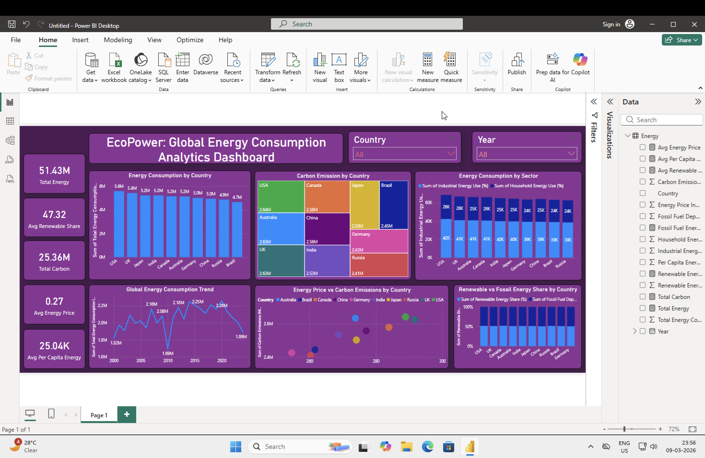

# ⚡ EcoPower: Global Energy Consumption Analytics Dashboard

This Power BI dashboard analyzes global energy consumption, carbon emissions, and renewable energy trends across multiple countries.

The objective of this project is to uncover patterns in energy usage, compare renewable and fossil fuel dependency, and understand how energy consumption relates to carbon emissions.

---

## 📊 Key Metrics

* **Total Energy Consumption:** 51.43M
* **Average Renewable Share:** 47.32%
* **Total Carbon Emissions:** 25.36M
* **Average Energy Price:** 0.27
* **Average Energy Consumption per Capita:** 25.04K

---

## 📈 Dashboard Insights

### 🌍 Energy Consumption by Country

* The USA and UK show the highest total energy consumption.
* Emerging economies like India and China show significant energy demand growth.

### 🌱 Renewable vs Fossil Energy

* Countries vary significantly in renewable energy adoption.
* Some countries still rely heavily on fossil fuels.

### 🏭 Sector-wise Energy Consumption

* Industrial sectors consume the largest share of energy.
* Household energy usage remains comparatively lower.

### 🌫 Carbon Emissions Analysis

* Higher energy consumption countries show higher carbon emissions.
* Strong correlation between fossil fuel dependency and emissions.

### 📉 Energy Consumption Trends

* Global energy consumption has shown fluctuations over time but generally follows an increasing trend.

---

## 📊 Visualizations Used

* KPI Cards
* Bar Charts
* Tree Map
* Line Chart
* Scatter Plot
* Stacked Column Chart
* Interactive Filters (Country, Year)

---

## 🛠 Tools Used

* **Power BI**
* **Data Modeling**
* **DAX Measures**
* **Data Visualization**

---

## 📷 Dashboard Preview

---

## 📂 Dataset Features

The dataset includes:

* Country
* Year
* Energy consumption
* Renewable energy share
* Fossil fuel dependency
* Carbon emissions
* Energy price
* Per capita energy usage

---

## 🎯 Project Objective

The goal of this project is to demonstrate **data visualization, energy analytics, and environmental data insights using Power BI.**
